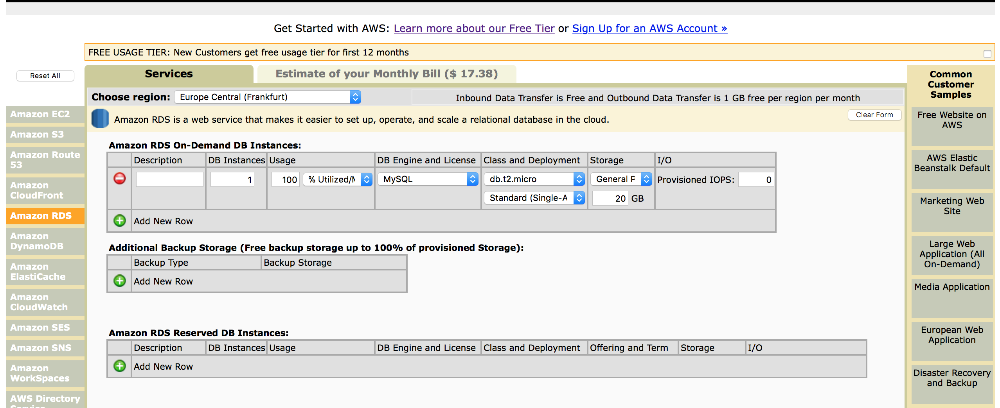
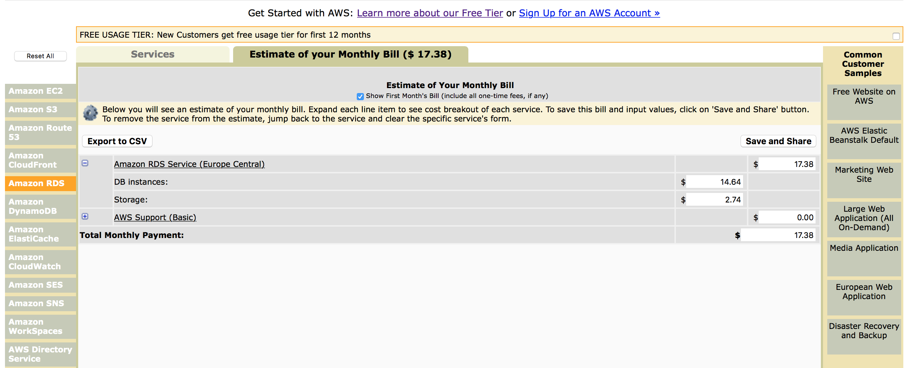
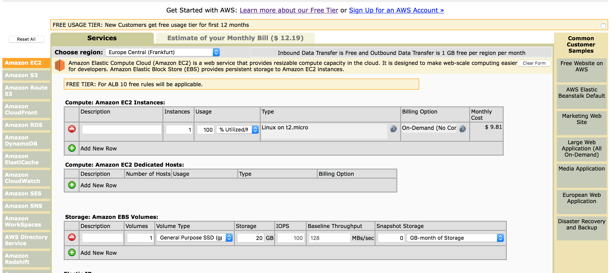
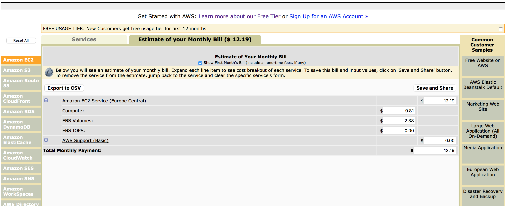
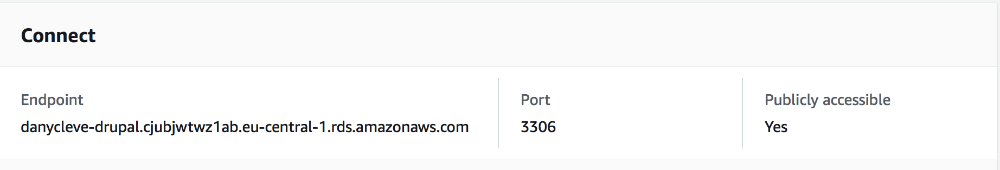
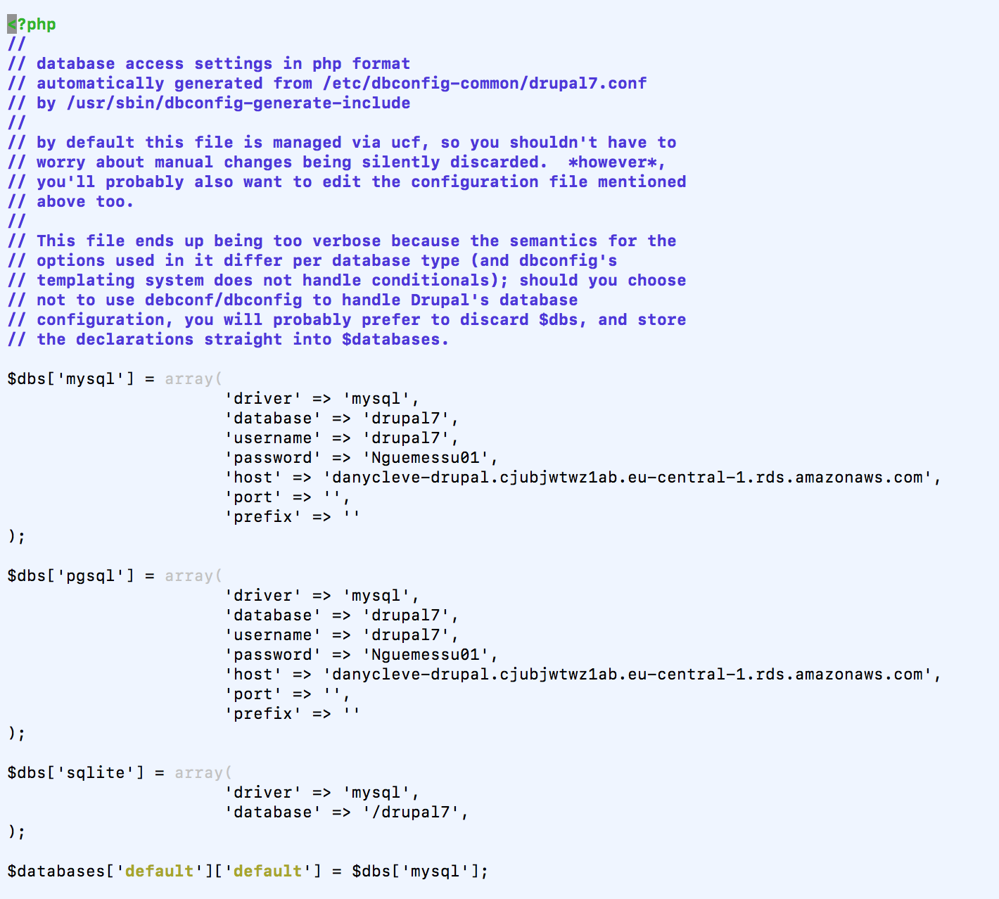
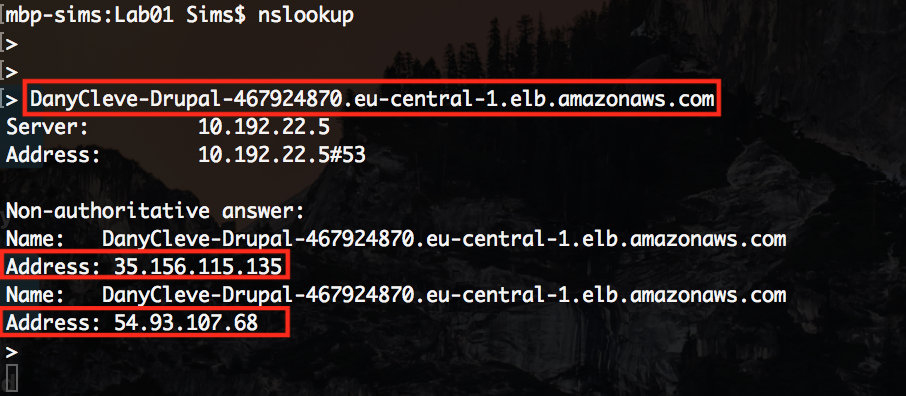
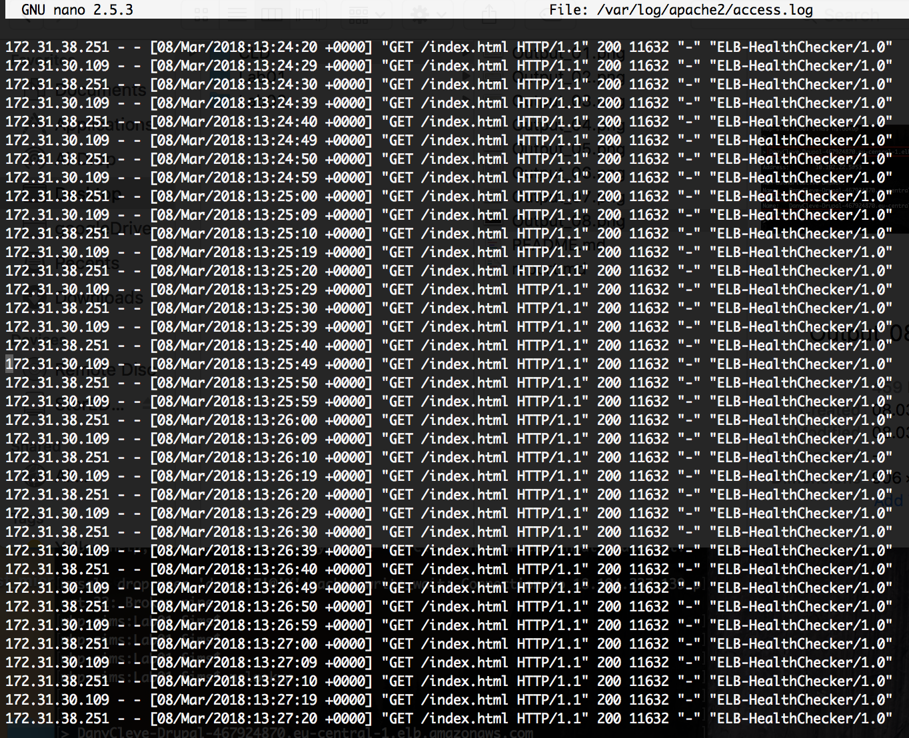

# CLD 
## LAB 02: APP SCALING ON AMAZON WEB SERVICES

#### By Ali Miladi & Dany Tchente

## TASK 1: SET UP

#### 1- Copy the estimated costs that were shown in the launch wizard into the report.
**Picture 1:** 

**Picture 2:** 

#### 2- Compare the costs of your RDS instance to a continuously running EC2 instance of the same size using the AWS calculator. (Don't forget to uncheck the Free Usage Tier checkbox at the top.)

**Picture 3:** 

**Picture 4:** 

bla bla bla

#### 3- In a two-tier architecture the web application and the database are kept separate and run on different hosts. Imagine that for the second tier instead of using RDS to store the data you would create a virtual machine in EC2 and install and run yourself a database on it. If you were the Head of IT of a medium-size business, how would you argue in favor of using a database as a service instead of running your own database on an EC2 instance? How would you argue against it?
bla bla bla
#### 4- Copy the endpoint address of the database into the report.

**Picture 5:** 

## TASK 2: CONFIGURE THE DRUPAL MASTER INSTANCE TO USE THE RDS DATABASE

## TASK 3: CREATE A CUSTOM VIRTUAL MACHINE IMAGE

## TASK 4: CREATE A LOAD BALANCER

#### 1- On your local machine resolve the DNS name of the load balancer into an IP address using the nslookup command (Linux or Windows). Write the DNS name and the resolved IP Address(es) into the report

#### 2- In the Apache access log identify the health check accesses from the load balancer and copy some samples into the report

## TASK 5: LAUNCH A SECOND INSTANCE FROM THE CUSTOM IMAGE

## TASK 6: TEST THE DISTRIBUTED APPLICATION