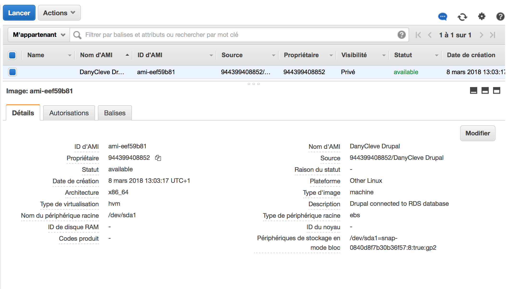

# CLD
## LAB 02: APP SCALING ON AMAZON WEB SERVICES

#### By Ali Miladi & Dany Tchente

## TASK 1: SET UP

> 1- Copy the estimated costs that were shown in the launch wizard into the report.
**Picture 1:**

**Picture 2:**

> 2- Compare the costs of your RDS instance to a continuously running EC2 instance of the same size using the AWS calculator. (Don't forget to uncheck the Free Usage Tier checkbox at the top.)

**Picture 3:**

**Picture 4:**

The `RDS` instance is finally more exoansive than the `EC2` instance continuously running. But this is worth it because the `RDS` instance is dedicated for the storage and has more space in our case.  

> 3- In a two-tier architecture the web application and the database are kept separate and run on different hosts. Imagine that for the second tier instead of using RDS to store the data you would create a virtual machine in EC2 and install and run yourself a database on it. If you were the Head of IT of a medium-size business, how would you argue in favor of using a database as a service instead of running your own database on an EC2 instance? How would you argue against it?
bla bla bla
> 4- Copy the endpoint address of the database into the report.

**Picture 5:**

## TASK 2: CONFIGURE THE DRUPAL MASTER INSTANCE TO USE THE RDS DATABASE

## TASK 3: CREATE A CUSTOM VIRTUAL MACHINE IMAGE

## TASK 4: CREATE A LOAD BALANCER

> 1- On your local machine resolve the DNS name of the load balancer into an IP address using the nslookup command (Linux or Windows). Write the DNS name and the resolved IP Address(es) into the report

> 2- In the Apache access log identify the health check accesses from the load balancer and copy some samples into the report

## TASK 5: LAUNCH A SECOND INSTANCE FROM THE CUSTOM IMAGE

> 1- Draw a diagram of the setup you have created showing the components (instances, database, load balancer, client) and how they are connected. Include the security groups as well

> 2- Using the Simple Monthly Calculator calculate the monthly cost of this setup. You can ignore traffic costs. (Make sure you don't forget to include a component in the calculation. Also don't forget to uncheck the Free Usage Tier checkbox at the top.)

## TASK 6: TEST THE DISTRIBUTED APPLICATION
> 1- Document your observations. Include screenshots of JMeter and the AWS console monitoring output

**Picture 6:**

**Picture 7:**

> 2-  When you resolve the DNS name of the load balancer into IP addresses while the load balancer is under high load what do you see? Explain

The only difference between the output of the `nslookup` command before and during the generated high load is that the address of the first server changes.
Actually, depending on the used `DNS` server, it can see one or more public IP addresses of the load balancer's public `DNS` name.
In our case, we could see two or three public `IP`s and the first one changes depending on the `DNS` server.
The only explanation that we found about the first address changing during the high load is that `AWS` assigns a set of public `IP` addresses add does a sort of load balancing over the load balancer itself.  

> 3- Did this test really test the load balancing mechanism? What are the limitations of this simple test? What would be necessary to do realistic testing?

This test is not realistic because
